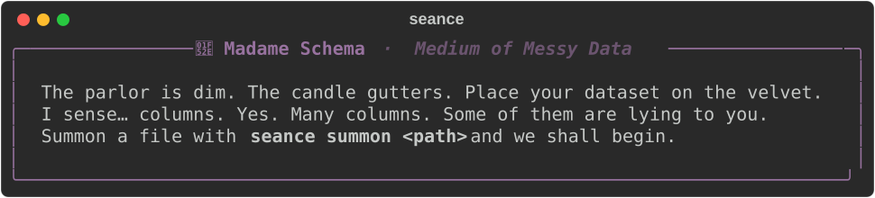
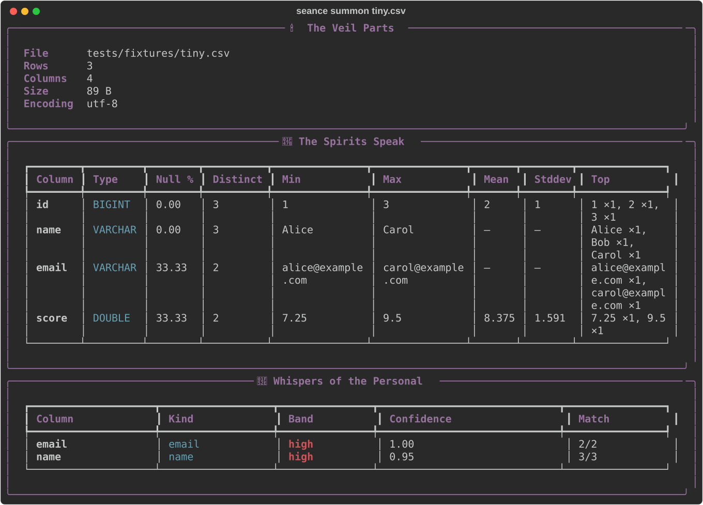

# schema-seance 🔮

> _Summon the spirits of your data._

A spooky little CLI that channels schemas, PII, and anomalies out of CSV,
JSONL, Parquet, and SQLite files. Madame Schema is your medium; DuckDB is
her crystal ball.

**Status:** early WIP — M1 scaffold, M2 readers, M3 full profiling, and M4
PII + anomalies landed. See [PLAN.md](./PLAN.md) for the full design and
milestones.

## Install

With [uv](https://docs.astral.sh/uv/) (recommended for hacking):

```bash
git clone https://github.com/rwrife/schema-seance
cd schema-seance
uv sync
uv run seance
```

Or with [`pipx`](https://pipx.pypa.io/) for an isolated install of the CLI
(works once v0.1.0 is published — tracking in [#6](https://github.com/rwrife/schema-seance/issues/6)):

```bash
pipx install schema-seance
seance --version  # 0.1.0
```

Or plain `pip` into any virtualenv:

```bash
pip install schema-seance
```

Or via [Homebrew](https://brew.sh/) (third-party tap, see
[`packaging/homebrew/`](./packaging/homebrew/)):

```bash
brew tap rwrife/schema-seance https://github.com/rwrife/homebrew-schema-seance
brew install schema-seance
```

## Hello, Madame Schema

Run `seance` with no arguments to summon the parlor:



## Summoning a file



Want motion? An animated walkthrough (greeting → `summon` → `--json`) is
generated from [`docs/demo/seance.tape`](./docs/demo/seance.tape) with
[VHS](https://github.com/charmbracelet/vhs):

```bash
vhs docs/demo/seance.tape   # writes docs/demo/seance.gif
```

The rendered `seance.gif` is committed alongside each release and embedded
here once available.

`seance summon` reads CSV/TSV, JSONL/NDJSON, Parquet, and SQLite files via
DuckDB and prints four sections:

- **The Veil Parts** — rows, columns, size, encoding.
- **The Spirits Speak** — per column: dtype, null %, distinct count, min,
  max, mean, stddev, and top values.
- **Whispers of the Personal** — PII heuristics (email, phone, credit-card
  with Luhn check, SSN-ish, IPv4/IPv6, likely-name columns, DOB) each with
  a confidence score in `[0, 1]` and a `low`/`medium`/`high` band.
- **Restless Anomalies** — mixed value shapes in VARCHAR columns,
  primary-key candidates with duplicates, high-null columns, and IQR-based
  numeric outliers.

```bash
uv run seance summon tests/fixtures/tiny.csv
uv run seance summon path/to/data.parquet
uv run seance summon path/to/data.sqlite --table events
uv run seance summon big.csv --sample 100000
uv run seance summon big.csv --json | jq '.columns[] | select(.null_pct > 50)'
uv run seance summon people.csv --fail-on-pii high   # CI smoke check
```

### Flags

- `--table NAME` — pick a SQLite table (defaults to the first one).
- `--sample N` — profile only the first `N` rows. Reported `rows` and
  `sampled`/`sample_size` reflect this.
- `--json` — emit a stable, versioned JSON document instead of the Rich
  view. See [`docs/json-schema.md`](./docs/json-schema.md).
- `--fail-on-pii {low|medium|high}` — exit with code **3** when any column
  has a PII finding at or above the chosen confidence band. See the
  exit-code contract below.

### Exit codes

| Code | Meaning                                                                |
| ---- | ---------------------------------------------------------------------- |
| `0`  | Profile completed successfully.                                        |
| `2`  | Input is unsupported, unreadable, or `--table` doesn't exist.          |
| `3`  | `--fail-on-pii` was set and a finding met or exceeded that confidence. |
| `4`  | `seance read` could not reach (or got nothing usable from) the LLM.    |

## Optional: ask the LLM for a reading

`seance read <file>` runs the same profile, then asks an OpenAI-compatible
chat endpoint for a three-paragraph “reading” in Madame Schema’s voice.
Nothing in this command touches the network until you invoke it, and the
standard `summon` path never reaches for an LLM.

Configure the provider via environment variables:

| Variable               | Required | Example                              |
| ---------------------- | -------- | ------------------------------------ |
| `SEANCE_LLM_BASE_URL`  | yes      | `https://api.openai.com/v1` / `http://localhost:11434/v1` |
| `SEANCE_LLM_MODEL`     | yes      | `gpt-4o-mini` / `llama3:8b`          |
| `SEANCE_LLM_API_KEY`   | no       | `sk-…` (skip for most local providers) |

```bash
# OpenAI
export SEANCE_LLM_BASE_URL=https://api.openai.com/v1
export SEANCE_LLM_API_KEY=sk-…
export SEANCE_LLM_MODEL=gpt-4o-mini
uv run seance read path/to/data.csv

# Local Ollama
export SEANCE_LLM_BASE_URL=http://localhost:11434/v1
export SEANCE_LLM_MODEL=llama3:8b
uv run seance read path/to/data.csv --no-show-profile
```

Flags: `--timeout SECONDS` (default 30) hard-caps the request;
`--no-show-profile` skips the standard rendered profile and shows only the
reading. Token counts (and a USD cost estimate for known OpenAI models) are
printed under the reading panel. If the call fails or times out, the
command exits **4** without ever printing a half-baked response.

## The parlor (interactive TUI)

`seance parlor <file>` opens a keyboard-first Textual TUI: a column
browser on the left, a paged sample of rows on the right, an SQL input
below, and a results pane. The file is registered as the DuckDB view
`data`, so any query against it works:

```sql
SELECT name, COUNT(*) FROM data GROUP BY name ORDER BY 2 DESC
```

Key bindings: `Enter` or `F5` run the query, `Ctrl+R` resets, `q` quits.
Results are capped at 200 rows unless you supply an explicit `LIMIT`.

The TUI is an **optional** extra so the base install stays small:

```bash
pipx install "schema-seance[tui]"
# or
pip install "schema-seance[tui]"
```

## Development

```bash
uv sync --all-groups
uv run ruff check .
uv run ruff format --check .
uv run pytest
```

CI runs the same on Python 3.11 and 3.12 via GitHub Actions.

## Releasing

Releases are tag-driven. Pushing a `vX.Y.Z` tag triggers
[`.github/workflows/release.yml`](./.github/workflows/release.yml), which builds
the sdist + wheel and publishes to PyPI via OIDC trusted publishing (no API
token stored in the repo). Before tagging:

1. Bump `version` in `pyproject.toml` and `schema_seance/__init__.py`.
2. Move the `[Unreleased]` entries in [CHANGELOG.md](./CHANGELOG.md) under a new
   `vX.Y.Z` section, dated.
3. `git tag vX.Y.Z && git push origin vX.Y.Z`.
4. The workflow uploads the build, runs a wheel-install smoke test
   (clean venv → `seance --help` → `seance summon ... --json`) so a
   broken wheel fails *before* it reaches PyPI, then publishes via
   OIDC. Cut the GitHub release from the tag with the changelog
   excerpt as the notes.

The PyPI project (`schema-seance`) must have this repo configured as a
trusted publisher for the `pypi` environment.

## Changelog

See [CHANGELOG.md](./CHANGELOG.md).

## License

MIT.
